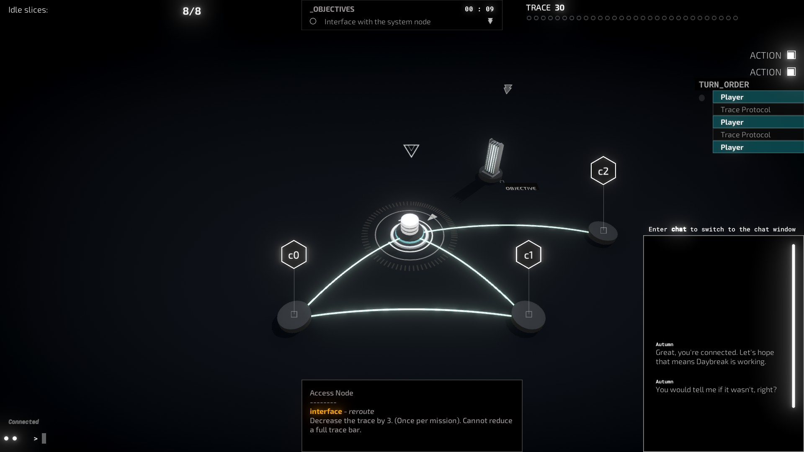
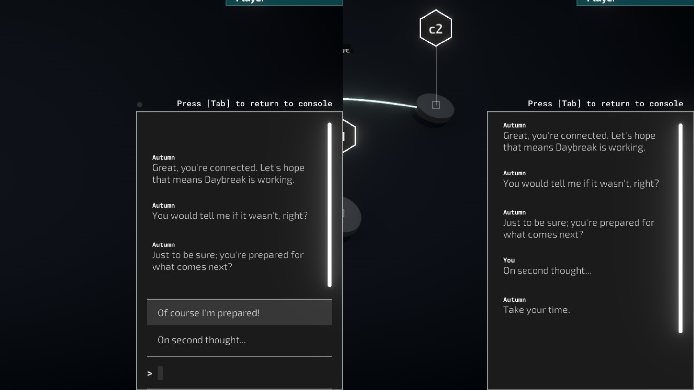

# Chat API
## Sending A Basic Message

```cs
SendChatText("You would tell me if it wasn't, right?", 6f, "Autumn")
```
`SendChatText(string message, float delay, [string character])`

No bells, no whistles. Inside the scripting tools for the Custom Campaign editor, use the above method to send a simple text message to the network chat, as a character.

## Handling Choices

