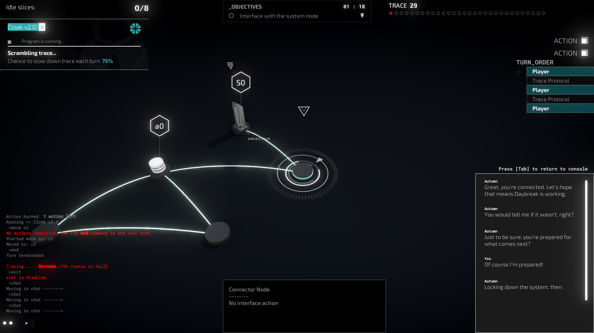

# Map API
## Toggling The Exit Command

```cs
ToggleExit(false)
```
`ToggleExit(bool canExit)`

A function which removes/gives the user's ability to use the `exit` command in-game. If you've got a high-stakes network, you should use this. To allow the player to use the command again, run `ToggleExit(true)`.