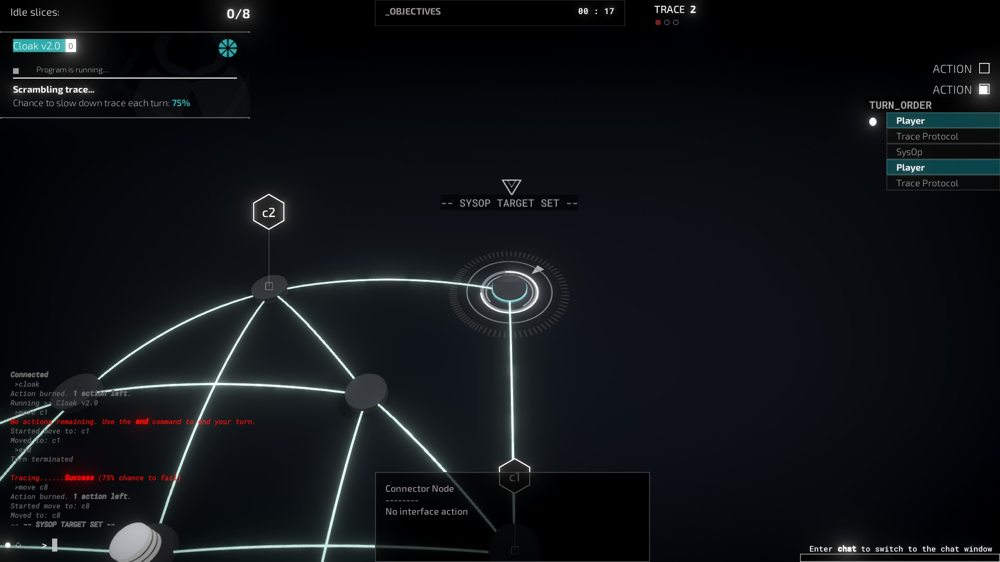

# SysOp API
## Setting SysOp ID
```cs
SetSysOpId("c9", "examplesysop")
```
`SetSysOpId(string currentNode, string id)`

Uniquely identifies a SysOp on the map. **THIS SHOULD BE USED ON THE MAP'S `OnMapLoad`!!!** You'll need this for the functions in the SysOp API.

## Setting SysOp Target

```cs
SetSysOpTarget("player", "examplesysop")
```
`SetSysOpTarget(string nodeAddress, string sysOpId)`

Sets the SysOp's target to the node address. If `nodeAddress` is set to `player`, then it will target the player's current position at the time it was fired. This will *not* instantly move the SysOp to the node, but the SysOp will move towards it.

## Teleporting SysOps
```cs
TeleportSysOpToNode("a0", "examplesysop")
```
`TeleportSysOpToNode(string nodeAddress, string sysOpId)`

Teleports the SysOp to the node address.